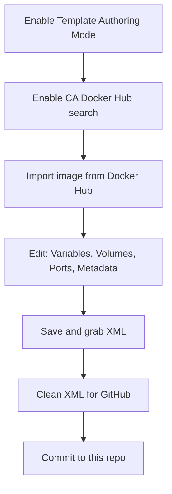

# Authoring Templates on Unraid

This guide follows the [Selfhosters — Writing a template compatible for Unraid](https://selfhosters.net/docker/templating/templating/) workflow (based on Squid's Docker FAQ). It is the **primary authoring reference** for this repository.

**Worked example throughout:** `domistyle/idrac6` (iDRAC 6 web console).

---

## Workflow overview



Two paths:

| Path | When to use |
|------|-------------|
| **Auto-generate from Docker image** | Image on Docker Hub; CA can draft from Dockerfile |
| **Manual XML** | GHCR-only, custom images, or full control — see [03-xml-reference.md](03-xml-reference.md#manual-authoring) |

---

## Prerequisites — Template Authoring Mode

Authoring Mode shows raw XML and unlocks template debugging.

1. **Stop Docker:** Settings → Docker → Enable Docker = **No** → Apply.  
   Unraid will not allow this setting while Docker is running.
2. Enable **Advanced View** (top-right of the web UI).
3. Settings → Docker → enable **Template Authoring Mode**.
4. Re-enable Docker → Apply.

---

## Path A — Auto-generate from Docker image

### 1. Search from Docker Hub

Enable extended search in Community Applications:

1. Open **Apps** → CA **Settings** (sidebar).
2. Enable **additional search** from Docker Hub.
3. Save.

Search for your image (e.g. `domistyle/idrac6`):

1. If CA already lists it, it may already be in the catalog — skip duplicating.
2. Type the image in the CA search bar.
3. Click **Get More Results From Docker Hub**.
4. CA shows results for maintainer and image name (similar names appear).
5. Click the **download-to-disk** icon so CA converts Dockerfile metadata into a template.

CA reads `EXPOSE`, `VOLUME`, `ENV`, and `publish` hints from the Dockerfile. Conversion is often **incomplete** — treat output as a draft and fix in the template editor.

### 2. Edit the template

Use the **container README** as the source of truth for required variables, ports, and paths. Enable **Advanced View** in the template editor if fields are missing.

Recommended edit order (matches upstream docs layout):

1. **Variables** (often listed first in README)
2. **Volumes** (paths / appdata)
3. **Ports**
4. **Metadata** (Overview, Category, Support, WebUI, Icon)

#### Variables

Click **Add another Path, Port, Variable, or Device** → set **Config Type** to **Variable**.

| GUI field | XML attribute | Example (idrac6) |
|-----------|---------------|------------------|
| Name | `Name` | `idrac host` |
| Key | `Target` | `IDRAC_HOST` |
| Value | *(leave empty)* | User fills at install |
| Default Value | `Default` | Skip if unknown; use `root` / `calvin` when docs specify defaults |
| Description | `Description` | Copy from container README when helpful |
| Display | `Display` | `always` for required vars users must set |
| Required | `Required` | `true` if container fails without it |
| Password Mask | `Mask` | `true` for passwords (`IDRAC_PASSWORD`) |

#### Volumes

Same **Add another…** link; Config Type stays **Path** (default).

| GUI field | Notes |
|-----------|-------|
| Container path | Becomes `Target`, e.g. `/config`, `/vmedia` |
| Default host path | e.g. `/mnt/user/appdata/idrac/vmedia` |
| Access Mode | Almost always **read/write** (`Mode="rw"`) |
| Required | Set **Yes** for proper appdata locations |

Volume-type configs ignore Password Mask.

#### Ports

**Add another…** → Config Type **Port**.

| GUI field | Notes |
|-----------|-------|
| Container port | From README, e.g. `5800` for web UI |
| Connection Type | **TCP** unless docs specify UDP |
| Display | Use `advanced-hide` for ports most users never need (e.g. raw VNC) |

#### Metadata

Basic templates work for personal use; **Community Applications** needs richer metadata:

| Field | Guidance |
|-------|----------|
| **Overview** | Intro from container README (primary description — see [03-xml-reference.md](03-xml-reference.md)) |
| **Category** | Use CA category picker; prefer **Application Categorizer** plugin for correct tags |
| **Support** | See support rules below |
| **Project** | Upstream GitHub or homepage |
| **Icon** | HTTPS URL to PNG (128×128); use the app's upstream raw icon |
| **WebUI** | Use **container port**: `http://[IP]:[PORT:5800]` — Unraid maps to host port |
| **TemplateURL** | Raw GitHub URL — [required format](06-publishing-to-github.md) |
| **ExtraParams** / **PostArgs** | Only if upstream docs require them |

**Support URL rules** ([Selfhosters](https://selfhosters.net/docker/templating/templating/#metadata)):

- **Third-party containers:** A Unraid forum support thread is preferred for CA. Using upstream GitHub issues (as in the idrac6 example) is common for personal templates but not ideal for CA submission.
- **Your own container:** Create a support thread on the [Unraid forums](https://forums.unraid.net/) and link it — do **not** only link your GitHub issues.

**WebUI:** Reference the **container** port inside `[PORT:n]`. Use `https://` when that port serves TLS.

### 3. Grab the XML

1. Click **Save** in the template editor.
2. View plain-text XML (Authoring Mode).
3. Unraid also writes the file to flash (e.g. under `templates-user/`).

Copy cleaned XML into `templates/<app-name>.xml` in this repository.

### 4. Clean the XML

CA exports duplicate data in legacy blocks. Follow [04-cleaning-xml.md](04-cleaning-xml.md) — summary:

1. Remove empty tags (`<MyIP/>`, empty `<ExtraParams/>`, etc.)
2. Remove `<Networking>`, `<Data>`, `<Environment>` when `<Config>` entries exist
3. Remove `<DateInstalled>` and `<Shell>` (unless shell is verified)
4. Set `<TemplateURL>` and HTTPS `<Icon>`

---

## Path B — Manual authoring (no CA import)

1. Start from [`docs/examples/scaffold-starter.xml.example`](../examples/scaffold-starter.xml.example) or [`docs/examples/base-xml.xml.example`](../examples/base-xml.xml.example) (Selfhosters baseXML).
2. Fill root tags — see [03-xml-reference.md — Fill the base](03-xml-reference.md#fill-the-base).
3. Add `<Config>` entries — see [Add a Config entry](03-xml-reference.md#add-a-config-entry).
4. Clean and validate.

---

## Tips (from Selfhosters)

### Predefined values (dropdown)

In `Default`, separate options with pipe `|`:

```xml
Default="false|true"
```

**Highly recommended** for boolean environment variables.

### Categories

Use the **Application Categorizer** plugin in Unraid to generate correct `<Category>` tags for CA discoverability.

---

## Map GUI fields to XML

| Template editor | XML |
|-----------------|-----|
| Config Type: Variable | `Type="Variable"` |
| Config Type: Path | `Type="Path"` |
| Config Type: Port | `Type="Port"` |
| Key | `Target` |
| Default Value | `Default` or element body |
| Password Mask | `Mask="true"` |
| Show more settings… | `Display="advanced"` or `advanced-hide` |

Full attribute list: [03-xml-reference.md — Shared attributes](03-xml-reference.md#shared-config-attributes).

---

## Before you commit

1. Clean XML → [04-cleaning-xml.md](04-cleaning-xml.md)
2. Validate → `.\scripts\validate-template.ps1 templates\my-app.xml`
3. Test on Unraid → [05-testing-on-your-server.md](05-testing-on-your-server.md)
4. Checklist → [app-template-checklist.md](app-template-checklist.md)

---

## Next step

→ [03-xml-reference.md](03-xml-reference.md) — full field list and Config syntax

→ [04-cleaning-xml.md](04-cleaning-xml.md) — idrac6 cleanup walkthrough
