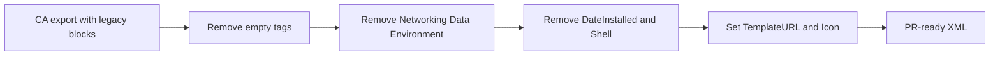

# Cleaning XML for GitHub and Community Applications

When Community Applications or Unraid exports a template, the XML contains **internal and duplicate** data. Clean before committing — workflow from [Selfhosters — Clean the XML](https://selfhosters.net/docker/templating/templating/#4-clean-the-xml), using `domistyle/idrac6` as the reference.

---

## Why clean?

CA adds tags Unraid uses at runtime but that should **not** ship in a shared template:

| Problem | Fix |
|---------|-----|
| Duplicate port/env/volume data | Keep `<Config>` only |
| Empty placeholder tags | Delete |
| Internal timestamps | Delete |
| Unverified shell | Delete |
| Local icon paths | Replace with HTTPS raw GitHub URL |

Benefits: smaller diffs, CA scan compatibility, single source of truth.

---

## Cleanup pipeline (idrac6 example)



### Step 1 — Remove empty tags

Delete tags closed without meaningful value:

```xml
<MyIP/>
<ExtraParams/>
<PostArgs/>
<CPUset/>
<DonateText/>
<DonateLink/>
<Labels/>
<TemplateURL/>
```

Keep tags only when populated (e.g. `<ExtraParams>--restart unless-stopped</ExtraParams>`).

### Step 2 — Remove legacy blocks (keep Config)

CA export includes **both** legacy blocks **and** `<Config>` entries. Selfhosters recommendation: **use Config only**.

Remove entirely when equivalent `<Config>` exists:

- `<Networking>` … `</Networking>`
- `<Data>` … `</Data>`
- `<Environment>` … `</Environment>`

Legacy port example (remove after Config port exists):

```xml
<Networking>
  <Mode>bridge</Mode>
  <Publish>
    <Port>
      <HostPort/>
      <ContainerPort>5800</ContainerPort>
      <Protocol>tcp</Protocol>
    </Port>
  </Publish>
</Networking>
```

Keep the Config form:

```xml
<Config Name="WebUI" Target="5800" Default="5800" Mode="tcp"
        Description="web interface port" Type="Port" Display="always"
        Required="true" Mask="false"/>
```

### Step 3 — Remove internal / risky tags

| Tag | Action |
|-----|--------|
| `<DateInstalled>` | **Always remove** — Unraid sets at install time |
| `<Date>` | **Always remove** — internal |
| `<Shell>` | **Remove unless verified** — wrong shell breaks exec |

Selfhosters PR-ready idrac6 retains: `Name`, `Repository`, `Registry`, `Network`, `Privileged`, `Support`, `Project`, `Overview`, `Category`, `WebUI`, `Icon`, `Description` (optional/legacy), and all `<Config>` lines.

### Step 4 — Fix metadata for GitHub

| Field | Before (CA export) | After (this repo) |
|-------|-------------------|-------------------|
| `Icon` | `/plugins/dynamix.docker.manager/images/question.png` | upstream raw PNG, e.g. `https://raw.githubusercontent.com/DomiStyle/docker-idrac6/master/icon.png` |
| `TemplateURL` | empty | `https://raw.githubusercontent.com/RapalS/UNRAID_DOCKER_TEMPLATES/main/templates/idrac6.xml` |
| `Support` | GitHub issues OK for personal use | Unraid forum thread preferred for CA |

### Step 5 — Fix authoring artifacts

| Issue | Fix |
|-------|-----|
| Tab in Target | `Target="IDRAC_PORT	"` → `Target="IDRAC_PORT"` |
| XML in Description | Escape `<` as `&lt;` and `>` as `&gt;` |
| Missing Overview | Move primary text to `<Overview>` |

---

## Before vs after

### After step 1 (empty tags removed)

Still contains `Networking`, `Data`, `Environment`, `DateInstalled`, `Shell`.

### After step 2 (Config-only)

Legacy blocks gone; may still have `DateInstalled`, `Shell`.

### PR-ready (Selfhosters target)

```xml
<?xml version="1.0"?>
<Container version="2">
  <Name>idrac6</Name>
  <Repository>domistyle/idrac6</Repository>
  <Registry>https://hub.docker.com/r/domistyle/idrac6/</Registry>
  <Network>bridge</Network>
  <Privileged>false</Privileged>
  <Support>https://forums.unraid.net/topic/YOUR_SUPPORT_TOPIC</Support>
  <Project>https://github.com/DomiStyle/docker-idrac6/</Project>
  <Overview>Allows access to the iDRAC 6 console without installing Java...</Overview>
  <Category>Tools: Network:Management</Category>
  <WebUI>http://[IP]:[PORT:5800]</WebUI>
  <TemplateURL>https://raw.githubusercontent.com/RapalS/UNRAID_DOCKER_TEMPLATES/main/templates/idrac6.xml</TemplateURL>
  <Icon>https://raw.githubusercontent.com/DomiStyle/docker-idrac6/master/icon.png</Icon>
  <Config Name="idrac host" Target="IDRAC_HOST" ... Type="Variable" Display="always" Required="true" Mask="false"/>
  <!-- remaining Config entries -->
</Container>
```

Note: `<Description>` is deprecated in favor of `<Overview>` ([Selfhosters](https://selfhosters.net/docker/templating/templating/#xml-field-explanations)); omit unless CA scan or long install guide requires it.

---

## Validate locally

```powershell
.\scripts\validate-template.ps1 templates\my-app.xml
```

```bash
./scripts/validate-template.sh templates/my-app.xml
```

CI (`.github/workflows/validate-xml.yml`) warns on legacy blocks and fails on malformed XML.

---

## Next step

→ [05-testing-on-your-server.md](05-testing-on-your-server.md)
