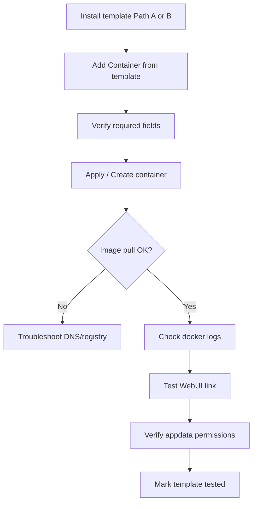

# Testing on Your Unraid Server

Use this loop to validate templates before publishing. Example server: **`192.168.x.10`** (replace with your Unraid IP).

---

## Pre-flight checklist

- [ ] Array is **Started**
- [ ] Docker is **Enabled** (Settings → Docker)
- [ ] You can reach Unraid UI at `http://192.168.x.10` (or your IP)
- [ ] DNS works (Settings → Network Settings — see [08-troubleshooting.md](08-troubleshooting.md))
- [ ] Template XML validated locally with `scripts/validate-template.ps1`

---

## Test loop



### 1. Install the template

**Path B (recommended):**

1. Docker → Docker Repositories
2. Add `https://github.com/RapalS/UNRAID_DOCKER_TEMPLATES`
3. Save

**Path A (single file):**

Copy XML to `/boot/config/plugins/dockerMan/templates-user/`.

### 2. Add Container

1. Docker → **Add Container**
2. Template dropdown → select your template
3. Enable **Advanced View**
4. Confirm:
   - Repository image is correct
   - Required variables are marked
   - Default appdata paths use `/mnt/user/appdata/<app>/`
   - Ports do not conflict with existing containers

### 3. Apply and verify pull

Watch the bottom of the UI for pull progress. On success, the container appears in **Docker Containers**.

SSH alternative:

```bash
ssh root@192.168.x.10
docker ps -a | grep -i myapp
docker logs myapp
```

### 4. Test WebUI

Click the container's **WebUI** icon or browse manually:

```
http://192.168.x.10:8080
```

Replace port with your template's host mapping.

### 5. Verify appdata permissions

For LinuxServer-style images (PUID/PGID):

```bash
ls -la /mnt/user/appdata/myapp
```

Expected owner often `99:100` (nobody:users). Fix if needed:

```bash
chown -R 99:100 /mnt/user/appdata/myapp
```

### 6. Re-test after XML changes

Unraid may cache templates:

1. Update XML in GitHub or on flash
2. Remove and re-add Docker Repository URL, **or** re-copy XML to `templates-user/`
3. **Add Container** again (existing containers are not auto-updated from template changes)
4. To update a running container: Edit → change env/ports → Apply, or recreate

---

## Remote validation script (optional)

From a machine with SSH access to Unraid:

```bash
# Copy template to flash
scp templates/my-app.xml root@192.168.x.10:/boot/config/plugins/dockerMan/templates-user/

# Validate on Unraid (if repo cloned there)
./scripts/validate-template.sh /boot/config/plugins/dockerMan/templates-user/my-app.xml
```

Or use [`scripts/install-to-unraid.sh`](../scripts/install-to-unraid.sh) with environment variables:

```bash
export UNRAID_HOST=192.168.x.10
export UNRAID_USER=root
./scripts/install-to-unraid.sh templates/nornicdb-cpu.xml
```

---

## Test matrix (record per template)

| Check | Pass? | Notes |
|-------|-------|-------|
| Template appears in dropdown | | |
| Image pulls without error | | |
| Container starts (healthy) | | |
| WebUI loads | | |
| Appdata persists after restart | | |
| Logs show no fatal errors | | |
| PUID/PGID correct | | N/A if not used |

Copy this table into your PR description when submitting a new template.

---

## nornicdb smoke test

| Step | Expected |
|------|----------|
| Install `nornicdb-cpu` template (branch **cpu-bge**) | Ports 7474, 7687 |
| Open WebUI | `http://YOUR_UNRAID_IP:7474` |
| Health | `curl http://YOUR_UNRAID_IP:7474/health` returns 200 |

---

## Next step

→ [06-publishing-to-github.md](06-publishing-to-github.md)
