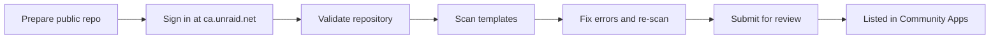

# Community Applications Submission

Official path to list this repository in the Unraid [Community Applications](https://unraid.net/community/apps) catalog via [Submit a Repository](https://ca.unraid.net/submit/new).

Primary references:

- [Submit a Repository](https://ca.unraid.net/submit/new) — validation, scan, and submission UI
- [Repository requirements](https://ca.unraid.net/submit/help/repository-xml) — Docker/plugin XML minimums
- [Repository Information XML (`ca_profile.xml`)](https://ca.unraid.net/submit/help/repository-info-xml) — maintainer profile gate
- [Builder guide](https://ca.unraid.net/submit/help/builders) — starter layout and checklist
- [Starter repository](https://github.com/unraid/unraid-community-apps-starter) — official scaffold
- [GitHub — Licensing a repository](https://docs.github.com/en/repositories/managing-your-repositorys-settings-and-features/customizing-your-repository/licensing-a-repository) — why a public repo needs an OSI license

---

## Submission flow



| Step | Where | What happens |
|------|--------|--------------|
| 0 | Your GitHub repo | Meet requirements below |
| 1 | [ca.unraid.net/submit/new](https://ca.unraid.net/submit/new) | Sign in with Unraid account |
| 2 | Add Repository | Enter public GitHub URL |
| 3 | **Validate** | Checks repo structure, license, `ca_profile.xml`, etc. |
| 4 | **Scan** | Parses each Docker/plugin XML for CA compatibility |
| 5 | **Submit** | Manual review by CA moderators |
| 6 | Live | Users discover templates in **Apps** without adding Docker Repositories manually |

Re-run **Validate** and **Scan** after every meaningful XML change.

---

## Repository requirements (official)

From [Submit a Repository](https://ca.unraid.net/submit/new) and the [builder guide](https://ca.unraid.net/submit/help/builders):

| Requirement | This repo | Notes |
|-------------|-----------|--------|
| Public GitHub repository | Required before submit | Private/archived/disabled repos are rejected |
| Active maintenance | Required | Moderators expect working templates |
| [OSI-approved license](https://opensource.org/licenses) | [`LICENSE`](../LICENSE) (MIT) | Covers **repo contents** (XML, docs, icons). See [GitHub licensing guide](https://docs.github.com/en/repositories/managing-your-repositorys-settings-and-features/customizing-your-repository/licensing-a-repository) |
| Valid Docker and/or plugin XML | `templates/*.xml` | Each app needs `<Repository>` (image) or plugin `<PluginURL>` |
| `ca_profile.xml` at repo root | [`ca_profile.xml`](../ca_profile.xml) | **Non-empty `<Profile>` is mandatory** — submission is blocked without it ([repository info XML](https://ca.unraid.net/submit/help/repository-info-xml)) |
| Placeholder usernames in URLs | This repo uses **`RapalS`** — forks should replace if publishing elsewhere |

### Licensing (important distinction)

- **This repository:** MIT License — OSI-approved, satisfies CA requirement for template/metadata licensing.
- **Container images:** Licensed separately by Docker Hub/GHCR publishers (NornicDB, nginx, etc.). Your MIT license does not re-license upstream images.
- **Icons:** Use a stable **HTTPS PNG** URL. The app's **upstream repository raw icon** is ideal (e.g. `https://raw.githubusercontent.com/<owner>/<repo>/main/path/to/icon.png`). If you reuse a third-party icon, confirm its license and add attribution if required.

---

## `ca_profile.xml` (repository profile)

CA uses [`ca_profile.xml`](https://ca.unraid.net/submit/help/repository-info-xml) for the **maintainer profile** shown in Community Applications — not per-app metadata.

### Required

| Rule | Detail |
|------|--------|
| File name | Exactly `ca_profile.xml` |
| Location | Repository root |
| Root element | `<CommunityApplications>` |
| `<Profile>` | **Non-empty** — markdown supported. Empty profile **blocks submission finalization** |

### Recommended

| Tag | Purpose |
|-----|---------|
| `<Icon>` | Repository/maintainer avatar — **HTTPS URL to PNG** (128×128). Point to the app's upstream raw icon. Do not use SVG or WebP — Unraid Docker UI does not render them reliably ([forum bug report](https://forums.unraid.net/bug-reports/stable-releases/custom-docker-icons-by-path-w-svg-or-webp-icons-unexpected-behavior-r3755/)) |
| `<WebPage>` | Canonical repo or project homepage |
| `<Forum>` | Unraid forum support thread (strongly recommended for community templates) |

### Optional

`<Discord>`, `<Reddit>`, `<Twitter>`, `<Facebook>`, `<DonateLink>`, `<DonateText>`, `<Photo>`, `<Video>` — only add real destinations you want public.

### Legacy format (do not use)

Older docs referenced `<CAProfile>` with `<Overview>`. The current CA submission pipeline expects `<CommunityApplications>` with `<Profile>`. This repo uses the current format in [`ca_profile.xml`](../ca_profile.xml).

---

## Docker template minimum (per app)

From [Repository XML format](https://ca.unraid.net/submit/help/repository-xml):

Each file in `templates/` must be valid `<Container version="2">` XML including:

| Tag | Purpose |
|-----|---------|
| `<Name>` | Container name (lowercase preferred) |
| `<Repository>` | Docker image to pull |
| `<Overview>` | Short summary in CA and Add Container |
| `<Description>` | Longer install guide (markdown) — strongly recommended for scan/review |
| `<Support>` | Forum thread or GitHub issues |
| `<Project>` | Upstream project URL |
| `<Category>` | CA category (use Application Categorizer when unsure) |
| `<WebUI>` | `http://[IP]:[PORT:n]` when app has a web UI |
| `<TemplateURL>` | **Raw** GitHub URL: `https://raw.githubusercontent.com/USER/REPO/branch/templates/app.xml` |
| `<Icon>` | HTTPS direct link to **PNG** (128×128). **Do not use SVG or WebP** — Unraid shows a question mark or blank icon ([R3755](https://forums.unraid.net/bug-reports/stable-releases/custom-docker-icons-by-path-w-svg-or-webp-icons-unexpected-behavior-r3755/)) |

See [03-xml-reference.md](03-xml-reference.md) for `<Config>`, `<Branch>`, and advanced fields.

---

## Pre-submit checklist for this repository

Complete these **before** clicking Submit at [ca.unraid.net/submit/new](https://ca.unraid.net/submit/new):

### GitHub

- [ ] Repository is **public** and pushed to `main`
- [ ] Confirm GitHub URLs use **`RapalS`** (maintainer) in templates and `ca_profile.xml`
- [ ] Confirm [`LICENSE`](../LICENSE) copyright line matches your name/org
- [ ] `<Icon>` points to a real HTTPS PNG (the app's upstream raw icon) — not a starter placeholder

### `ca_profile.xml`

- [ ] `<Profile>` describes your collection and support paths (non-empty)
- [ ] `<Icon>` and `<WebPage>` use real URLs (not placeholders)
- [ ] Uncomment and set `<Forum>` to your Unraid support thread (recommended)

### Templates (`templates/`)

- [ ] Run `python scripts/validate.py --strict templates ca_profile.xml` locally — zero errors
- [ ] Every published template has real `TemplateURL`, `Support`, `Project`, `Category`, `Icon`
- [ ] Use a stable HTTPS PNG icon URL (the app's upstream raw icon, e.g. `https://raw.githubusercontent.com/<owner>/<repo>/main/icon.png`)
- [ ] No empty `<Device>` paths, no bind-mounts that break upstream images (see [nornicdb.md](apps/nornicdb.md))

### Validation pipeline

```powershell
# Local
.\scripts\validate-template.ps1 templates\nornicdb-hermes-memory-cpu.xml
.\scripts\validate-template.ps1 templates\nornicdb-hermes-memory-gpu.xml
python scripts/validate.py --strict templates ca_profile.xml
```

```bash
# On Unraid or Linux
./scripts/validate-template.sh templates/nornicdb-hermes-memory-cpu.xml
./scripts/validate-template.sh templates/nornicdb-hermes-memory-gpu.xml
python3 scripts/validate.py --strict templates ca_profile.xml
```

Then in the browser:

1. [ca.unraid.net/submit/new](https://ca.unraid.net/submit/new) → Sign in
2. Enter `https://github.com/RapalS/UNRAID_DOCKER_TEMPLATES`
3. **Validate** → fix all errors
4. **Scan** → fix all errors/warnings
5. Repeat until clean
6. **Submit** for review

---

## Common validate / scan failures

| Issue | Fix |
|-------|-----|
| Missing or empty `<Profile>` in `ca_profile.xml` | Use `<CommunityApplications>` format; see [repository info XML](https://ca.unraid.net/submit/help/repository-info-xml) |
| Wrong `ca_profile` root (`<CAProfile>`) | Migrate to `<CommunityApplications>` |
| Placeholder `YOUR_USERNAME` / `YOUR_GITHUB_USERNAME` | This repo uses `RapalS`; replace only in forks |
| Missing OSI license | Add `LICENSE` file (MIT, Apache-2.0, etc.) — [GitHub guide](https://docs.github.com/en/repositories/managing-your-repositorys-settings-and-features/customizing-your-repository/licensing-a-repository) |
| Invalid `TemplateURL` | Must be `https://raw.githubusercontent.com/...` |
| Missing `<Overview>` / `<Description>` | Add readable text for moderators |
| Starter / placeholder icon | Point `<Icon>` to a real HTTPS PNG (the app's upstream raw icon) |
| Legacy `<Networking>` / `<Data>` blocks | Use `<Config>` only — run [validate.py](../scripts/validate.py) |
| Unsafe `ExtraParams` | Document privileged/GPU flags; remove unless required |
| External icon 404 or SVG in Docker UI | Use a stable raw HTTPS **PNG** URL (e.g. the app's upstream raw icon) |

---

## After approval

- Templates appear in **Apps** search for all Unraid users with Community Applications installed.
- You continue maintaining XML on GitHub; CA syncs on Unraid's feed schedule.
- Keep [CI validation](../.github/workflows/validate-xml.yml) enabled on pull requests.

### Related install paths (not the same as CA listing)

| Path | Users get templates via |
|------|-------------------------|
| **Community Applications** (this doc) | Apps tab after moderator approval |
| **Docker Repositories** | Manual repo URL under Docker settings — see [01-install-templates.md](01-install-templates.md) |
| **Flash `templates-user/`** | SCP/copy XML to Unraid flash — see [05-testing-on-your-server.md](05-testing-on-your-server.md) |

---

## Support resources

- [CA submission support (Unraid)](https://product.unraid.net/b/community-apps-submission-support)
- [Forum — Community Applications plugin](https://forums.unraid.net/topic/38582-plug-in-community-applications/)
- [Contact Unraid support](https://unraid.net/contact)

---

## Next step

→ [08-troubleshooting.md](08-troubleshooting.md)
